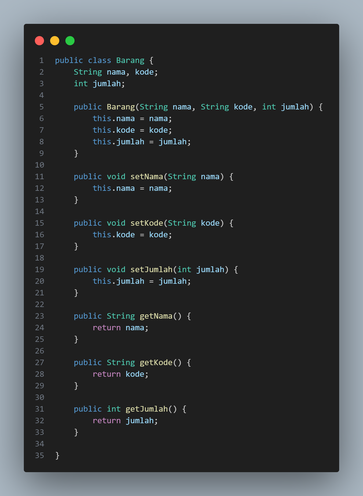
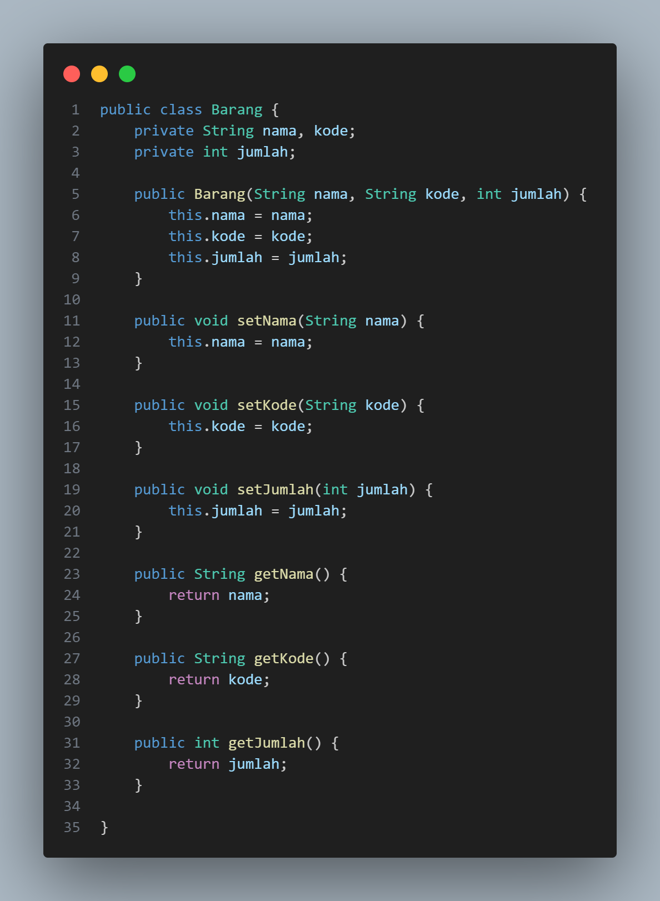
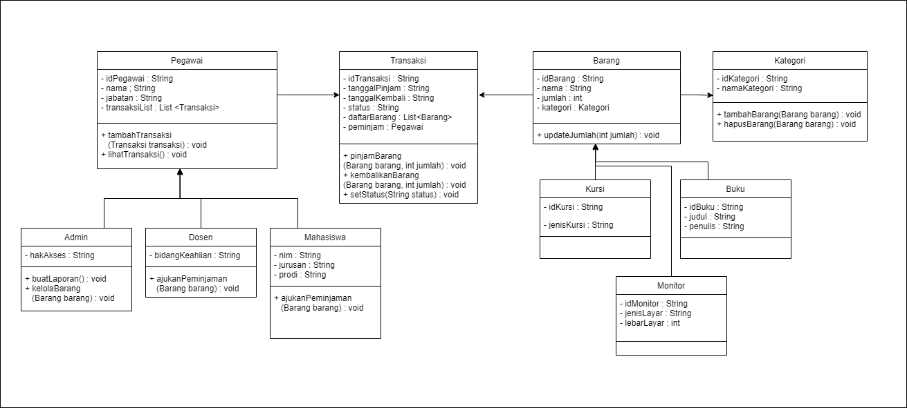

LAPORAN QUIZ 1  

NAMA : FADHLUROHMAN AL FARABI  
KELAS : TI - 2C  
NIM : 2241720081 

1. Class dan Object

- Apa yang dimaksud dengan "class" dalam pemrograman berorientasi objek?

        Jawab : Class dalam pemrograman berorientasi objek adalah sebuah blueprint atau prototype dari sebuah object.

- Bagaimana Anda mendefinisikan objek dari sautu class dalam bahasa pemrograman Java ?

        Jawab : Untuk mendefinisikan objek dari suatu class dalam java. Kita perlu menginstansiasinya terlebih dahulu dengan cara "namaClass namaObject = new namaClass();"

- Misalkan Anda memiliki class "Barang" dalam sistem informasi inventaris. Bagaimana Anda akan membuat objek "laptop" dari class tersebut ?

        Jawab : Barang laptop = new Barang();

2. Encapsulation

- Jelaskan konsep encapsulation dalam pemrograman berorientasi objek dan mengapa hal ini penting dalam pengembangan sistem informasi inventaris barang.

        Jawab : Pengkapsulan berarti mengemas beberapa item bersama-sama menjadi satu unit yang tertutup dalam rangka menyembunyikan struktur internal suatu obyek dari lingkungan/dunia luar.Dalam sistem informasi inventaris barang, ini diperlukan agar user tidak sembarangan untuk merubah jumlah barang yang ada. Seperti mengedit ketersediaan kursi.

- Dalam konteks sistem informasi inventaris, sebutkan contoh atribut (variabel) yang harus di-encapsulate dan mengapa.

        Jawab :
        - Nama Barang : Guna menghindari perubahan oleh user terhadap nama barang dari luar kelas. Sehingga kita dapat melakukan validasi terkait nama barang.
        - Jumlah Barang : Untuk dapat memastikan bahwa jumlah barang tidak menjadi negatif atau melampaui kuota atau batas nya.
        - Harga Baranag : Untuk dapat memastikan bahwa harga tetap sesuai dengan tipe data yang benar. Sehingga dapat membantu dalam perhitungan total nilai inventaris.
        - Kode Barang : Karena, kode barang itu merupakan sesuatu yang unik. Kita harus mengencapsulasinya agar tetap menjaga keunikannya dan mencegah duplikasi.
        - Lokasi Penyimpanan : Untuk dapat memastikan bahwa lokasi yang kita set sesuai dengan format yang benar. Sehingga mempermudah kita dalam memanajemen inventaris kita.

3. Relasi Kelas

- Apa yang dimaksud dengan relasi antara kelas dalam pemrograman berorientasi objek?

        Jawab : Dalam pemrograman berorientasi objek (OOP), "relasi antara kelas" merujuk pada hubungan atau interaksi yang terjadi antara kelas-kelas yang berbeda dalam suatu sistem atau program.

- Dalam sistem informasi inventaris barang, bagaimana Anda akan menggambarkan relasi antara kelas "Barang" dan kelas "Kategori"?

        Jawab : Untuk kelas "Barang" dan "Kategori". Kita akan menggambarkan relasi nya adalah "many to one". Yang dimana setiap kategori itu memiliki banyak barang.

4. PBL

- Berdasarkan kasus sistem informasi inventaris barang. coba buat sebuah class sederhana beserta atribut dan metodenya menggambarkan suatu entitas dalam sistem tersebut (misalnya, class "Barang").

Source Code

- Bagaimana Anda akan menggunakan encapsulation untuk melindungi atribut-atribut dalam class tersebut?

        Jawab : Untuk menggunakan encapsulation khususnya untuk melindungi atribut dalam class tersebut kita bisa menambahkan private pada setiap atribut. Perhatikan pada gambar dibawah ini.

        Pada gambar diatas kita bisa melihat masing-masing atribut memiliki ranah private atau hanya bisa diakses di class itu atau file itu. Diluar itu tidak bisa diakses.

- Gambarkan hierarki class atau hubungan antar class yang mungkin ada dalam sistem informasi inventaris barang di jurusan Teknologi Informasi. Berikan contoh relasi antar class (misalnya, inheritance atau association) dalam konteks tersebut.

