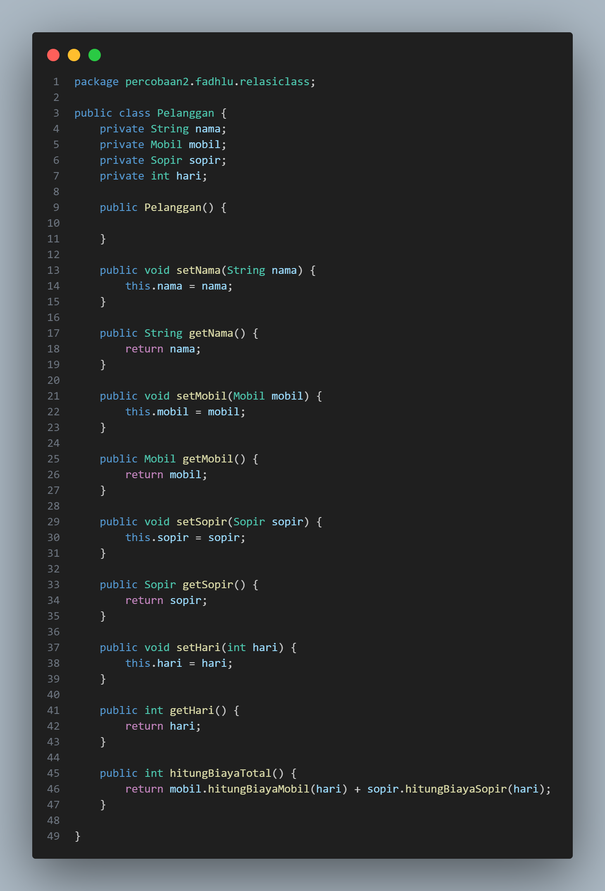
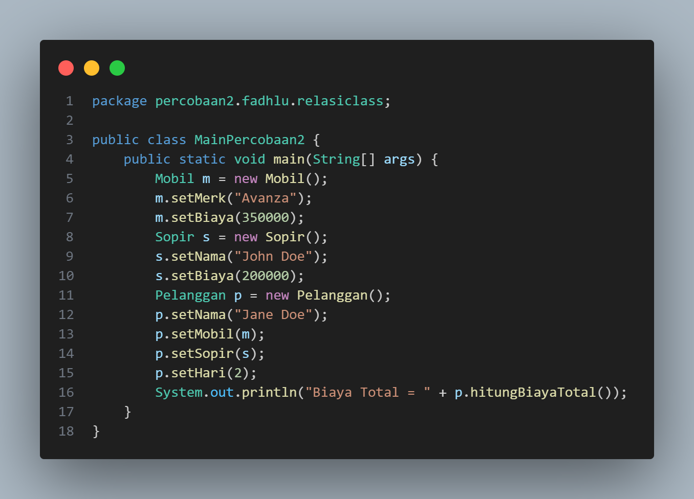
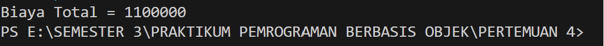
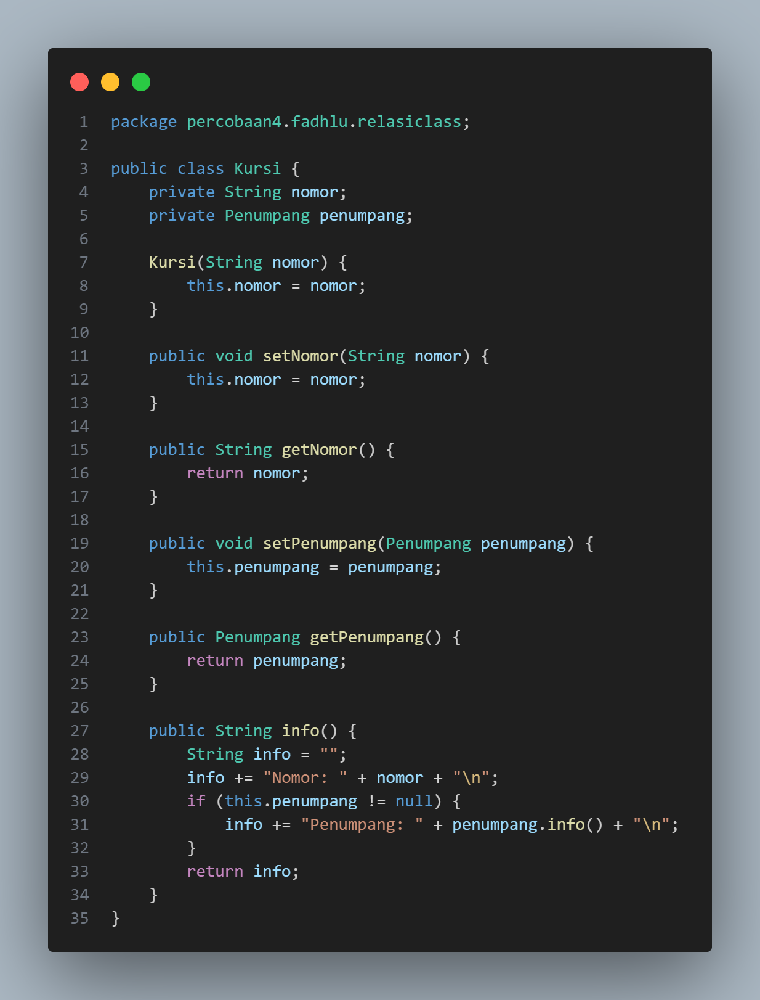

LAPORAN JOBSHEET 4  
PRAKTIKUM PEMROGRAMAN OOP 

NAMA : FADHLUROHMAN AL FARABI 
NIM : 2241720081 
KELAS : TI - 2C 
 
PERCOBAAN 1 

 SOURCE CODE 

CLASS Laptop 

CLASS Processor 

CLASS MainPercobaan1 

 OUTPUT

Pertanyaan

1.  Di dalam class Processor dan class Laptop, terdapat method setter dan getter untuk masing-masing atributnya. Apakah gunanya method setter dan getter tersebut ?

        Jawab : Method setter digunakan untuk mengatur nilai atribut atau properti objek. Sedangkan, untuk Method getter digunakan untuk membaca nilai suatu atribut atau properti objek.

2.  Di dalam class Processor dan class Laptop, masing-maing terdapat konstruktor default dan konstruktor berparameter. Bagaimanakah beda penggunaan dari kedua jesni konstruktor tersebut ?

        Jawab : Konstruktor adalah Method istimewa yang digunakan saat pembuatan objek (instansiasi). Perbedaan antara konstruktor parameter dengan konstruktor default adalah konstruktor berparameter bisa menerima inputan data. Sehingga ketika objek pertama kali dibuat bisa langsung untuk mengisi atribut yang telah ditetapkan pada parameter. Jadi, tidak perlu untuk memasukkan value atribut secara terpisah.

3.  Perhatikan class Laptop, diantara 2 atribut yang dimiliki (merk dan proc), atribut manakah yang bertipe object ?

        Jawab : Atribut yang bertipe objek adalah proc. Yang merupakan objek yang dibuat dari class Processor.

4.  Perhatikan class Laptop, pada baris manakah yang menunjukkan bahwa class Laptop memiliki relasi dengan class Processor

        Jawab : Baris yang menunjukkan relasi antara class Laptop dan class Processor ditunjukkan pada gambar dibawah ini.

5.  Perhatikan pada class Laptop, Apakah guna dari sintaks proc.info()?

        Jawab : Pada sintaks tersebut digunakan untuk memanggil method info() pada objek proc. Sehingga pada bisa untuk menampilkan informasi dari Processor dengan menggunakan objek proc sebagai perantara.

6.  Pada class MainPercobaan1, terdapat baris kode  
    Laptop l = new Laptop("Thinkpad",p);  
    Apakah p tersebut? Dan apakah yang terjadi jika baris kode tersebut diubah menjadi  
    Laptop l = new Laptop("Thinkpad", new Processor("Intel i5",3));  
    Bagaimanakah hasil program saat dijalankan, apakah ada perubahan?

        Jawab : Penulisan "Laptop l = new Laptop("Thinkpad", new Processor("Intel i5",3));" memiliki arti yang sama sebenarnya dengan "Laptop l = new Laptop("Thinkpad",p);".
        Yang menjadi pembeda adalah pada penulisan yang kedua harus membuat objek terlebih dahulu secara terpisah, lalu objek tersebut dipanggil dan dimasukkan ke dalam parameter. Pada penulisan pertama langsung menginisiasi objek tersebut tanpa membuat objek secara terpisah.

        Source Code

        Output yang dihasilkan akan sama seperti output pada awalnya.

 
PERCOBAAN 2

 SOURCE CODE 

CLASS Mobil 

CLASS Sopir 

CLASS Pelanggan 

CLASS MainPercobaan2 

 OUTPUT

Pertanyaan

1. Perhatikan class Pelanggan. Pada baris program manakah yang menunjukkan bahwa class Pelanggan memiliki relasi dengan class Mobil dan class Sopir ?

        Jawab : Pada method hitungBiayaTotal(). Pada statement dari method tersebut memanggil method hitungBiayaMobil() yang berada pada objek mobil yang dimana objek mobil itu sendiri terbentuk dari Class Mobil. Sehingga terdapat relasi antara kedua Class tersebut.

2.  Perhatikan method hitungBiayaSopir pada class Sopir, serta method hitungBiayaMobil pada class Mobil. Mengapa menurut anda method tersebut harus memiliki argument hari ?

        Jawab : Karena untuk menghitung jumlah biaya diperlukan hari untuk menghitung total biaya yang dikeluarkan. Sedangkan, pada atribut class itu sendiri tidak terdapat atribut hari. Sehingga diperlukan sebuah inputan berupa argumen pada parameter method tersebut.

3.  Perhatikan kode dari class Pelanggan. Untuk apakah perintah mobil.hitungBiayaMobil(hari) dan sopir.hitungBiayaSopir(hari) ?

        Jawab : Perintah tersebut digunakan untuk memanggil method hitungBiaya dari kedua objek tersebut. Yaitu dari objek mobil dan objek sopir.

4.  Perhatikan class MainPercobaan2. Untuk apakah sintaks p.setMobil(m) dan p.setSopir(s) ?

        Jawab : Sintaks tersebut berupa setter yang digunakan untuk mengirim nilai atribut ke dalam objek p atau pelanggan. Karena, pada objek pelanggan memiliki atribut objek yaitu mobil dan sopir. Maka, untuk mengisi nilai dari objek tersebut digunakan method setMobil() dan setSopir().

5.  Perhatikan class MainPercobaan2. Untuk apakah proses p.hitungBiayaTotal() tersebut ?

        Jawab : Proses tersebut digunakan untuk mengembalikan nilai dari method hitungBiayaTotal(). Sehingga nilai yang dikeluarkan

6.  Perhatikan class MainPercobaan2, coba tambahkan pada baris terakhir dari method main dan amati perubahan saat di-run!  
    System.out.println(p.getMobil().getMerk());  
    Jadi untuk apakah sintaks p.getMobil().getMerk() yang ada di dalam method main tersebut ?

        Jawab : Dari hasil output diatas dapat kesimpulan bahwa penggunaan method p.getMobil().getMerk() digunakan untuk mendapatkan atau get merk dari objek mobil tersebut.

PERCOBAAN 3

SOURCE CODE

Class Pegawai

Class KeretaApi

Class MainPercobaan3

Output

Pertanyaan

1.  Di dalam method info() pada class KeretaApi, baris this.masinis.info() dan this.asisten.info() digunakan untuk apa?

        Jawab : masinis dan asisten adalah sebuah objek yang dibuat dari class Pegawai. Pada objek tersebut ada method info() yang digunakan untuk menampilkan data nip dan nama yang dimiliki oleh objek tersebut.

2.  Buatlah main program baru dengan nama class MainPertanyaan pada package yang sama. Tambahkan kode berikut pada method main()! 
    Pegawai masinis = new Pegawai("1234","Spongebob Squarepants"); 
    KeretaApi keretaApi = new KeretaApi("Gaya Baru","Bisnis",masinis); 
    System.out.println(keretaApi.info());

    

3.  Apa hasil output dari main program tersebut? Mengapa hal tersebut dapat terjadi ?

    

4.  Perbaiki class KeretaApi sehingga program dapat berjalan!  
    Source Code
    
    Output  
    

  
PERCOBAAN 4

SOURCE CODE

Class Gerbong

Class Kursi

Class Penumpang

Class MainPercobaan4

Output

Pertanyaan

1.  Pada main program dalam class MainPercobaan4, berapakah jumlah kursi dalam Gerbong A?

        Jawab : Terdapat 10 kursi dengan dibuktikan dengan jumlah nomor ada 10. Perhatikan pada output program berikut.

2.  Perhatikan potongan kode pada method info() dalam class Kursi. Apa maksud kode tersebut? 
    if (this.penumpang != null){
    info += "Penumpang: " + penumpang.info() + "\n";
    }

        Jawab: Pada potongan kode berikut adalah untuk menampilkan informasi tentang penumpang. Untuk menampilkan informasi tersebut. Maka, akan dilakukan pengecekan apakah atribut pada objek penumpang memiliki value atau nilainya. Jika iya maka kita akan memanggil method info() dari objek penumpang untuk menampilkan informasi yang ada pada penumpang tersebut.

3.  Mengapa pada method setPenumpang() dalam class Gerbong, nilai nomor dikurangi dengan angka 1?

        Jawab : Karena kita menggunakan Array of Object maka indeks untuk menginputkan objek tersebut harus dimulai dari angka 0. Sehingga untuk bisa memastikan hal itu maka nilai nomor akan dikurangi dengan angka 1.

4.  Instansiasi objek baru budi dengan tipe Penumpang, kemudian masukkan objek baru tersebut pada gerbong dengan gerbong.setPenumpang(budi, 1). Apakah yang terjadi ?
     
    Source Code
    

 
Output

  5. Modifikasi program sehingga tidak diperkenankan untuk menduduki kursi yang sudah ada penumpang lain!
 
Source Code
 

Class Kursi

Class Gerbong

Class MainPercobaan4

Output

