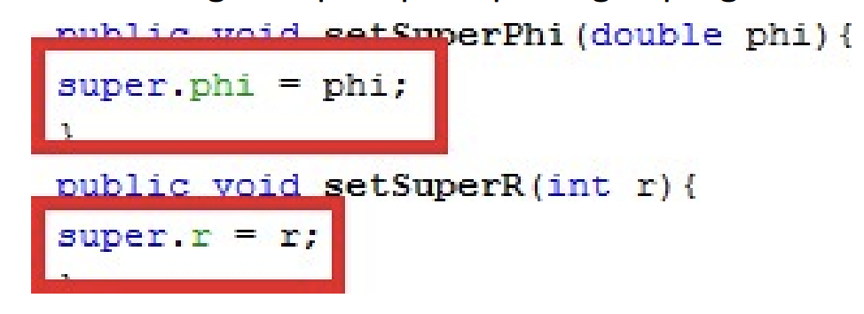

NAMA : FADHLUROHMAN AL FARABI  
KELAS : TI-2C  
 

PERCOBAAN 1  
SOURCE CODE  

CLASS classA

CLASS classB

CLASS Percobaan1

PERTANYAAN

1.  Pada percobaan 1 diatas program yang dijalankan terjadi error, kemudian perbaiki sehingga program tersebut bisa dijalankan dan tidak error!

            Jawab : Untuk debugging pada percobaan 1 kita perlu memperbaiki sumber masalah nya yaitu pada class classB. Yang dimana kita perlu menambahkan relasi pewarisan dengan menggunakan extends seperti pada gambar dibawah ini.

    
Source code

Output

2.  Jelaskan apa penyebab program pada percobaan 1 ketika dijalankan terdapat error!

        Jawab : Error terjadi dikarenakan pada classB dan classA tidak memiliki relasi. Sehingga ketika objek yang dibuat dari classB pada class Percobaan1 mencoba mengakses method atau atribut pada classA tidak akan bisa.

PERCOBAAN 2  
SOURCE CODE  

CLASS classA

CLASS classB

CLASS Percobaan2

PERTANYAAN

1.  Pada percobaan 2 diatas program yang dijalankan terjadi error, kemudian perbaiki sehingga program tersebut bisa dijalankan dan tidak error!

        Jawab : Pada Percobaan 2 diatas terdapat masalah pada ClassB ketika mengakses atribut parent nya pada ClassA dikarenakan pada atribut ClassA memiliki akses private. Sehingga pada ClassA diperlukan sebuah method untuk mengakses atribut tersebut. Lalu, diperlukan relasi antara ClassA dan ClassB. Perhatikan kode program berikut.

    
Source code

    
ClassA

ClassB

Output

2.  Jelaskan apa penyebab program pada percobaan 2 ketika dijalankan terdapat error!

        Jawab : Error terjadi dikarenakan pada ClassB dan ClassA tidak memiliki relasi dan pada atribut ClassA memiliki sebuah atribut dengan hak akses private. Sehingga ketika mengakses langsung atribut tersebut tidak akan bisa. Oleh karena itu, diperlukan sebuah method tambahan untuk mengakses atribut tersebut.

PERCOBAAN 3  
SOURCE CODE  

CLASS Bangun

CLASS Tabung

CLASS Percobaan3

OUTPUT

PERTANYAAN

1.  Jelaskan fungsi "super" pada potongan program berikut di class Tabung!

        Jawab : Penggunaan Kata kunci super dipakai untuk merujuk pada member dari parent class. Jadi, pada "super.phi = phi" adalah kita merujuk pada Class Parentnya adalah Class Bangun dengan variabel yang kita target adalah phi. Lalu, pada "super.r = r" juga sama kita merujuk pada Class Parentnya adalah Class Bangun dengan variabel yang kita target adalah r.

2.  Jelaskan fungsi "super" dan "this" pada potongan program berikut di class Tabung!

        Jawab : Fungsi "super" untuk merujuk pada member dari parent class. Sedangkan "this" merujuk pada member dari class itu sendiri. Jadi, pada "super.phi" dan "super.r" kita merujuk pada parent class yaitu class Bangun dengan member phi dan r. Lalu, pada "this.t" kita merujuk pada class itu sendiri yaitu class Tabung dengan atribut t.

3.  Jelaskan mengapa pada class Tabung tidak dideklarasikan atribut "phi" dan "r" tetapi class tersebut dapat mengakses atribut tersebut!

        Jawab : Karena class Tabung merupakan hasil pewarisan dari class Bangun. Yang dimana class Tabung bisa mengakses atribut atau method yang ada pada class Bangun tanpa perlu mendeklarasikan pada class Tabung sendiri. Jadi, hanya tinggal memanggil saja atribut atau method yang dibutuhkan dari class Bangun.

PERCOBAAN 4  
SOURCE CODE  

CLASS ClassA

CLASS ClassB

CLASS ClassC

CLASS Percobaan4

OUTPUT

PERTANYAAN

1.  Pada percobaan 4, sebutkan mana class yang termasuk superclass dan subclass, kemudian jelaskan alasannya!

        Jawab :
        a. ClassA
        - ClassA adalah superclass dalam hierarki ini.
        - ClassA tidak meng-extend (mewarisi) dari kelas lain.
        - ClassA adalah kelas dasar atau paling atas dalam hierarki ini.
        - Tidak ada kelas yang meng-extend dari ClassA.

        b. ClassB
        - ClassB adalah subclass dari ClassA.
        - ClassB meng-extend (mewarisi) dari ClassA.
        - Ini berarti ClassB mewarisi sifat dan perilaku dari ClassA.
        - ClassB adalah anak dari ClassA dalam hierarki ini.

        c. ClassC
        - ClassC adalah subclass dari ClassB.
        - ClassC meng-extend (mewarisi) dari ClassB.
        - Dengan demikian, ClassC secara tidak langsung juga merupakan subclass dari ClassA melalui rantai pewarisan (inheritance) dari ClassB.
        - Ini berarti ClassC mewarisi sifat dan perilaku dari ClassA melalui ClassB.
        - ClassC adalah cucu dari ClassA dalam hierarki ini.

        Dari penjelasan diatas didapat sebuah rangkuman berikut
        - ClassA adalah superclass (kelas induk).
        - ClassB adalah subclass dari ClassA.
        - ClassC adalah subclass dari ClassB dan secara tidak langsung juga merupakan subclass dari ClassA melalui pewarisan (inheritance) dari ClassB.

2.  Ubahlah isi konstruktor default ClassC seperti berikut

Tambahkan kata super() di baris Pertaman dalam konstruktor defaultnya. Coba jalankan kembali class Percobaan4 dan terlihat tidak ada perbedaan dari hasil outputnya!

Source Code

Output

3.  Ubah isi konstruktor default ClassC seperti berikut:

Ketika mengubah posisi super() dibaris kedua dalam konstruktor defaultnya dan terlihat ada error. Kemudian kembalikan super() kebaris pertama seperti sebelumnya, maka errornya akan hilang.

Perhatikan hasil keluaran ketika class Percobaan4 dijalankan. Kenapa bisa tampil output seperti berikut pada saat instansiasi objek test dari class ClassC

Jelaskan bagaimana urutan proses jalannya konstruktor saat objek test dibuat!

        Jawab : Jadi urutan prosesnya seperti berikut
        a. Objek test dibuat menggunakan konstruktor ClassC. Oleh karena itu, konstruktor ClassC akan dijalankan terlebih dahulu.
        b. Dalam konstruktor ClassC, terdapat pemanggilan super(), yang mengakibatkan pemanggilan konstruktor dari kelas induk, yaitu ClassB. Oleh karena itu, konstruktor ClassB dijalankan sebelum kembali ke konstruktor ClassC.
        c. Konstruktor ClassB memanggil super(), yang kembali memanggil konstruktor dari kelas induk teratas, yaitu ClassA. Oleh karena itu, konstruktor ClassA dijalankan terlebih dahulu.
        d. Konstruktor ClassA mencetak pesan "Konstruktor A dijalankan."
        e. Setelah konstruktor ClassA selesai dijalankan, program kembali ke konstruktor ClassB, yang kemudian mencetak pesan "Konstruktor B dijalankan."
        f. Kemudian, program melanjutkan ke konstruktor ClassC dan mencetak pesan "Konstruktor C dijalankan."

4. Apakah fungsi super() pada potongan program dibawah ini di ClassC!

        Jawab : Kata kunci super() digunakan untuk memanggil konstruktor dari kelas induk (superclass) dalam kelas turunan (subclass). Dengan kata lain, super() memastikan bahwa konstruktor kelas induk dijalankan sebelum konstruktor kelas turunan dalam rantai pewarisan.
