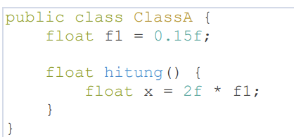
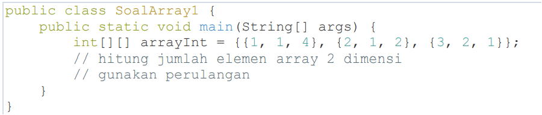
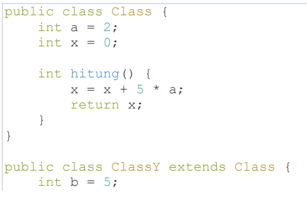
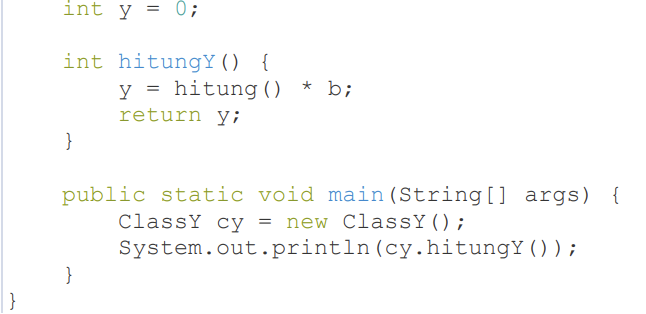
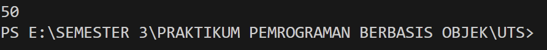
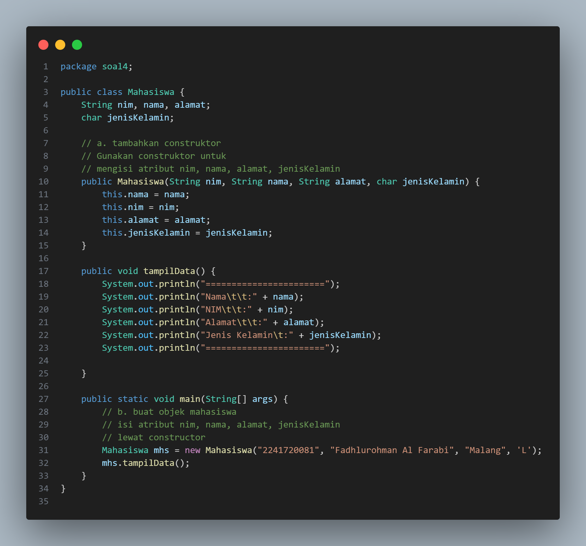
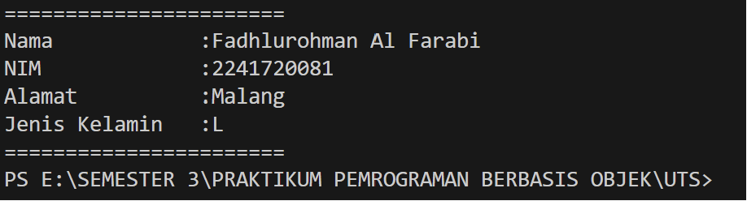
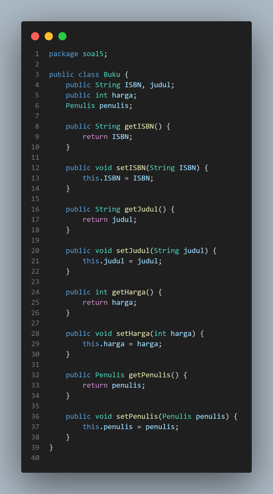
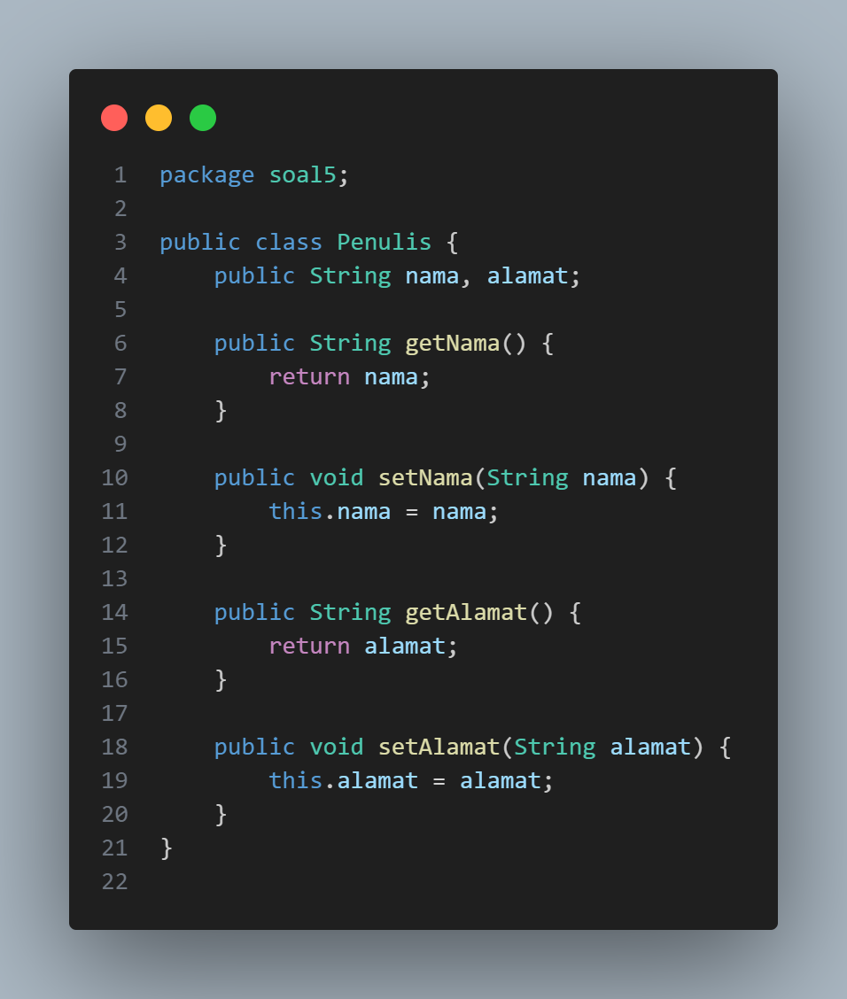

# UTS OOP

## FADHLUROHMAN AL FARABI [TI - 2C]

### Soal 1 : Penulisan Class

Berdasarkan contoh class ClassA dibawah ini, jelaskan apakah penulisan source code pada contoh class sudah benar. Jika tidak, apa yang perlu diperbaiki ?

        Jawab : Dari penulisan class tersebut terdapat kekurangan yaitu pada method hitung() tidak terdapat statement return. Seharusnya terdapat statement return untuk mengembalikan nilai pada method hitung() agar class tersebut dapat dijalankan.

### Soal 2 : Perhitungan Jumlah Elemen Array 2 Dimensi

Pada class SoalArray1, terdapat array 2 dimensi dengan ukuran 3x3. Tuliskan code Java untuk menghitung jumlah total elemen array tersebut dengan menggunakan perulangan.

### Soal 3 : Pewarisan Atribut dan Method

Pada sourcecode yang diberikan, ClassY merupakan turunan dari class Class. Sebutkan atribut dan method apa saja yang diwarisi oleh ClassY dari kelas induknya (class Class). Jelaskan juga apa output dari code yang ditulis pada class ClassY dan bagaimana nilai tersebut diperoleh.

        Jawab : Atribut dan Method yang diwarisi oleh ClassY adalah atribut a dan x. Lalu, untuk method yang diwariskan adalah method hitung(). Untuk hasil output dapat dilihat dari gambar dibawah ini, yang dimana alur untuk memanggil hasil tersebut adalah dengan memanggil method hitung() yang berada pada class Class. Lalu, hasil dari itu akan dikalikan dengan variabel b dan nilai nya akan dikembalikan kepada fungsi main tersebut.

### Soal 4 : Class Mahasiswa dengan Constructor

Dalam class Mahasiswa, lengkapi code dengan:

a. Menambahkan constructor untuk mengisi atribut nim, nama, alamat, dan jenisKelamin.

b. Membuat objek mahasiswa dan mengisi atribut nim, nama, alamat, dan jenisKelamin melalui constructor.

Berikut untuk Source Code nya

Berikut untuk Outputnya

### Soal 5 : Penulis

Perhatikan class diagram berikut dan Buatlah Source Code dalam Bahasa Java berdasarkan class diagram tersebut.

Berikut untuk Source Code Class Buku.java

Berikut untuk Source Code Class Penulis.java

